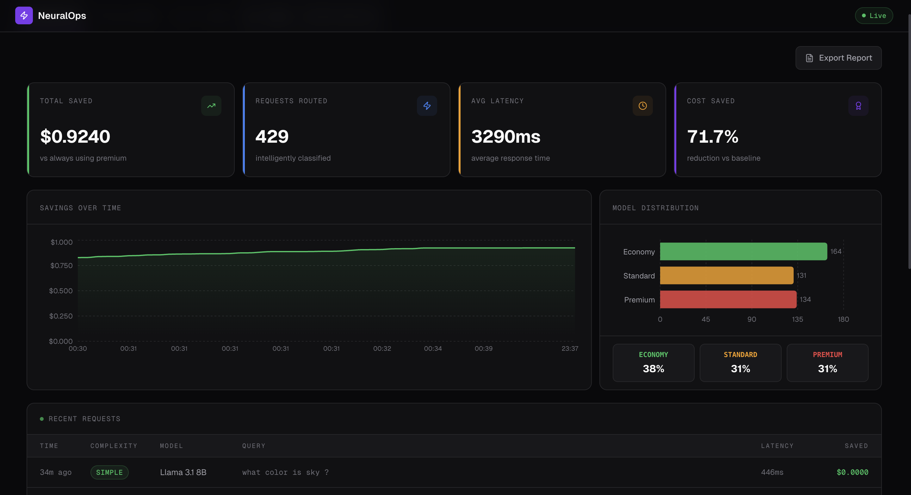
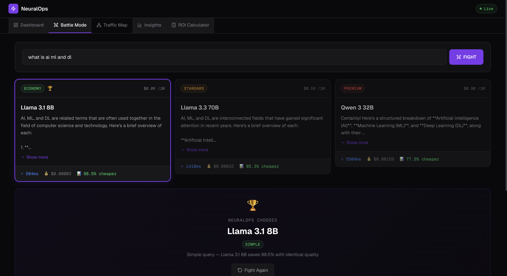
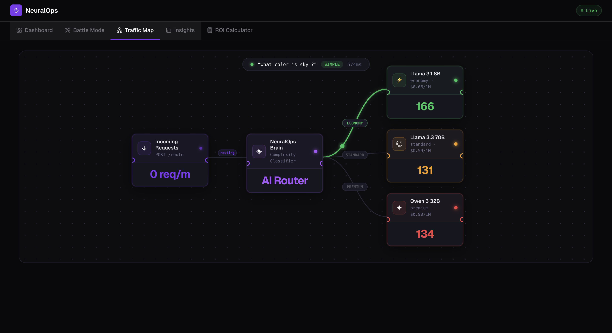
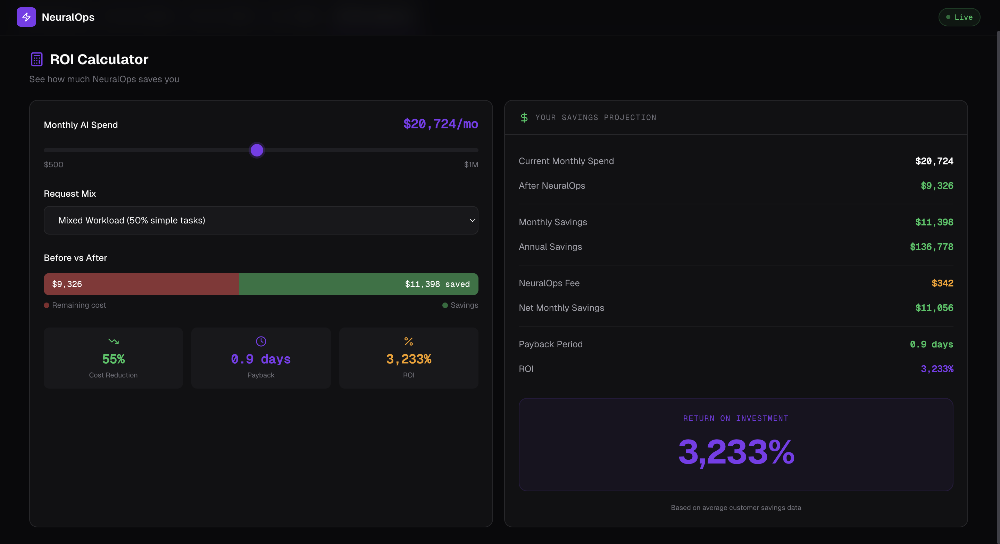

<div align="center">


# NeuralOps

### The Intelligent AI Inference Gateway

**Stop paying premium rates for every AI request. NeuralOps automatically routes each prompt to the cheapest model capable of answering it — saving up to 85% on LLM costs without sacrificing quality.**

<br/>

[](https://fastapi.tiangolo.com/)
[](https://react.dev/)
[](https://python.org/)
[](https://groq.com/)
[](LICENSE)
[](CONTRIBUTING.md)

<br/>

> 🏆 **2nd Runner Up — ₹5000 Prize** — Built in 36 hours at hackathon

<br/>

[Features](#-features) · [Demo](#-demo) · [Quick Start](#-quick-start) · [Pricing](#-pricing) · [Architecture](#-architecture) · [API Reference](#-api-reference) · [Roadmap](#-roadmap)

</div>

---

## 🧠 The Problem

Every company using AI APIs today pays a flat premium rate for **every single request** — regardless of whether that request needs frontier intelligence or could be answered by a model 15x cheaper.

A user asks: *"What is the capital of France?"*

| Without NeuralOps | With NeuralOps |
|---|---|
| Routes to premium model → **$0.000018** | Routes to Llama 3.1 8B → **$0.0000012** |
| **93% of cost wasted** | **93% saved automatically** |

This waste compounds at scale:

| Monthly AI Spend | Wasted (est. 70%) | Annual Waste |
|---|---|---|
| $5,000 | $3,500 | **$42,000** |
| $50,000 | $35,000 | **$420,000** |
| $500,000 | $350,000 | **$4,200,000** |

**NeuralOps fixes this — automatically, with zero changes to your existing code.**

---

## ✨ Features

### 🎯 Intelligent Routing Engine
Every prompt is classified as **SIMPLE**, **MEDIUM**, or **COMPLEX** using a fast LLM classifier, then routed to the optimal cost-tier model. No configuration needed.

### ⚔️ Battle Mode
Send the same prompt to all 3 models simultaneously. See responses, latency, cost, and composite scores side-by-side. NeuralOps picks the winner using complexity-aware scoring.

### 📊 Real-Time Dashboard
Live WebSocket-powered stats — total requests, cumulative savings, routing distribution, and per-request activity feed. Zero page refreshes.

### 🗺️ Traffic Flow Visualization
Interactive node-graph showing how requests flow from classifier → router → model tier, with live health indicators per node.

### 📈 Insights Panel
Deep analytics on request history: complexity distribution, per-model savings breakdown, NeuralOps Intelligence Report with automatic recommendations, and activity timeline.

### 💰 ROI Calculator
Input your monthly AI spend — get projected savings, annual ROI, payback period, and NeuralOps fee. Pure math, no API calls.

### 🛡️ Self-Healing System
Simulate model outages by toggling health states. The router automatically falls back through a priority chain — requests always get routed to a healthy model with zero downtime.

### 🤖 Three-Layer Fallback Classifier
If the AI classifier fails: → Rule-based keyword fallback → Hardcoded COMPLEX safety fallback. Quality is never compromised.

---

## 🎬 Demo

### Smart Routing — Same API, Different Models
```bash
# Simple question → Economy model (Llama 3.1 8B)
curl -X POST http://localhost:8000/route \
  -H "Content-Type: application/json" \
  -d '{"text": "What is 2+2?"}'

# Response includes:
# "tier": "economy"
# "savings_percentage": 93.3
# "latency_ms": 147

# Complex question → Premium model (Qwen 3 32B)  
curl -X POST http://localhost:8000/route \
  -H "Content-Type: application/json" \
  -d '{"text": "Design a distributed payment system for 10 million users"}'

# Response includes:
# "tier": "premium"
# "complexity": "COMPLEX"
# "latency_ms": 4821
```

### Battle Mode — Let Models Compete
```bash
curl -X POST http://localhost:8000/battle \
  -H "Content-Type: application/json" \
  -d '{"text": "Explain how transformers work in ML"}'

# All 3 models respond in parallel
# NeuralOps picks the winner
# You see cost, latency, quality score for each
```

---

## 🚀 Quick Start

### Prerequisites
- Python 3.11+
- Node.js 18+
- Groq API Key (free at [console.groq.com](https://console.groq.com))

### 1. Clone
```bash
git clone https://github.com/YOUR_GITHUB_USERNAME/NeuralOps.git
cd NeuralOps
```

### 2. Backend Setup
```bash
cd backend

# Create virtual environment
python -m venv .venv
source .venv/bin/activate      # macOS/Linux
# .venv\Scripts\activate       # Windows

# Install dependencies
pip install fastapi uvicorn aiosqlite python-dotenv groq httpx

# Configure environment
cp .env.example .env
# Add your GROQ_API_KEY to .env

# Start server
uvicorn main:app --reload --port 8000
```

### 3. Frontend Setup
```bash
# New terminal
cd frontend
npm install
npm run dev
```

Open [http://localhost:3000](http://localhost:3000) 🎉

### 4. Seed Demo Data (Optional)
```bash
# Populates dashboard with ~300 realistic requests
cd backend
python seed_data.py
```

### Environment Variables
Create `backend/.env`:
```env
GROQ_API_KEY=gsk_...                      # Required
CLASSIFIER_MODEL=llama-3.1-8b-instant     # Classifier model
CHEAP_MODEL=llama-3.1-8b-instant          # Economy tier
MID_MODEL=llama-3.3-70b-versatile         # Standard tier
PREMIUM_MODEL=qwen/qwen3-32b              # Premium tier
DATABASE_URL=neuralops.db                 # SQLite path
```

---

## 💸 Pricing

**We earn only when you save.**

NeuralOps charges **3% of your monthly savings** — nothing more. Zero risk for you.

| Monthly AI Spend | Est. Savings | NeuralOps Fee | Your Net Gain |
|---|---|---|---|
| $1,000 | ~$700 | $21 | **$679** |
| $10,000 | ~$7,000 | $210 | **$6,790** |
| $50,000 | ~$35,000 | $1,050 | **$33,950** |
| $500,000 | ~$350,000 | $10,500 | **$339,500** |

> **Minimum fee: $99/month.**
> If NeuralOps doesn't save you money — you don't pay. Simple.

---

## 🏗️ Architecture

```
┌──────────────────────────────────────────────────────────────┐
│                  FRONTEND  (React 19 + Vite)                 │
│                                                              │
│  ┌───────────┐ ┌────────────┐ ┌──────────┐ ┌────────────┐  │
│  │ Dashboard │ │Battle Mode │ │ Traffic  │ │  Insights  │  │
│  │(Recharts) │ │            │ │   Map    │ │            │  │
│  └───────────┘ └────────────┘ └──────────┘ └────────────┘  │
│  ┌──────────────────┐  ┌─────────────────────────────────┐  │
│  │  ROI Calculator  │  │       Self-Healing Panel        │  │
│  └──────────────────┘  └─────────────────────────────────┘  │
└─────────────────────────┬────────────────────────────────────┘
                          │ REST + WebSocket
┌─────────────────────────▼────────────────────────────────────┐
│                  BACKEND  (FastAPI)                           │
│                                                              │
│  ┌────────────┐  ┌──────────┐  ┌────────────────────────┐   │
│  │ Classifier │→ │  Router  │→ │     Cost Tracker       │   │
│  │(Llama 8B)  │  │  Engine  │  │                        │   │
│  └────────────┘  └──────────┘  └────────────────────────┘   │
│  ┌────────────┐  ┌──────────┐  ┌────────────────────────┐   │
│  │Rule-Based  │  │Self-Heal │  │  SQLite (aiosqlite)    │   │
│  │  Fallback  │  │ Manager  │  │                        │   │
│  └────────────┘  └──────────┘  └────────────────────────┘   │
└───────┬──────────────┬──────────────────┬────────────────────┘
        │              │                  │
  ┌─────▼──────┐ ┌─────▼──────┐ ┌────────▼───────┐
  │ Llama 3.1  │ │ Llama 3.3  │ │  Qwen 3 32B   │
  │    8B      │ │    70B     │ │               │
  │  Economy   │ │  Standard  │ │   Premium     │
  │ $0.06/1M   │ │ $0.59/1M   │ │  $0.90/1M    │
  └────────────┘ └────────────┘ └───────────────┘
        └──────────────┴──────────────────┘
                   Groq API
```

### Request Flow

```
1.  POST /route  ←  User prompt arrives
2.  Classifier   →  SIMPLE / MEDIUM / COMPLEX + confidence score
3.  Router       →  Selects cheapest healthy model
4.  Groq API     →  Model generates response
5.  Cost Tracker →  Calculates actual cost vs premium baseline
6.  SQLite       →  Request saved to database
7.  WebSocket    →  Dashboard updated in real time
8.  Response     →  Returned with full metadata
```

### Fallback Chain

| Complexity | Primary  | Fallback 1 | Fallback 2 |
|---|---|---|---|
| SIMPLE  | Economy  | Standard | Premium |
| MEDIUM  | Standard | Premium  | Economy |
| COMPLEX | Premium  | Standard | Economy |

If **all models fail** → honest 503 with retry guidance.

---

## 🧮 How Costs Are Calculated

### Latency
```python
start = time.time()
response = await call_model(prompt, model)
latency_ms = (time.time() - start) * 1000
```

### Cost Per Request
```python
tokens = response.usage.prompt_tokens + response.usage.completion_tokens

PRICE_PER_TOKEN = {
    "llama-3.1-8b-instant":    0.06   / 1_000_000,
    "llama-3.3-70b-versatile": 0.59   / 1_000_000,
    "qwen/qwen3-32b":          0.90   / 1_000_000,
}

actual_cost   = tokens * PRICE_PER_TOKEN[model_used]
baseline_cost = tokens * PRICE_PER_TOKEN["qwen/qwen3-32b"]
savings       = baseline_cost - actual_cost
savings_pct   = (savings / baseline_cost) * 100
```

### Battle Mode Scoring
Complexity-aware composite score:

| Complexity | Cost Weight | Speed Weight | Quality Weight |
|---|---|---|---|
| SIMPLE  | 80% | 15% | 5%  |
| MEDIUM  | 15% | 15% | 70% |
| COMPLEX | 5%  | 5%  | 90% |

---

## 📡 API Reference

### `POST /route`
Route a prompt to the optimal model.

**Request:**
```json
{ "text": "Your prompt here" }
```

**Response:**
```json
{
  "request_id": "uuid",
  "response": "Model response text",
  "model_used": "Llama 3.1 8B",
  "tier": "economy",
  "complexity": "SIMPLE",
  "confidence": 0.97,
  "routing_reason": "Single factual question",
  "latency_ms": 147,
  "input_tokens": 12,
  "output_tokens": 18,
  "actual_cost": 0.0000018,
  "cost_without_neuralops": 0.000027,
  "savings": 0.0000252,
  "savings_percentage": 93.3,
  "is_fallback": false
}
```

### `POST /battle`
Run the same prompt against all 3 models simultaneously.

### `GET /stats`
Aggregate statistics — total requests, savings, model distribution.

### `GET /history?limit=50&offset=0`
Paginated request history.

### `GET /health`
Current health state of all model tiers.

### `POST /health/toggle`
Toggle a model's health state (simulate outage/recovery).

```json
{ "model_key": "llama-3.1-8b-instant", "healthy": false }
```

### `WebSocket /ws`
Real-time event stream:
- `new_request` — fired on every routed request
- `stats_update` — updated aggregate stats
- `health_change` — model health state changes

---

## 📁 Project Structure

```
NeuralOps/
├── backend/
│   ├── main.py              # FastAPI app, routes, WebSocket
│   ├── classifier.py        # LLM + rule-based prompt classifier
│   ├── router.py            # Routing table, health, fallback chains
│   ├── model_client.py      # Async Groq API calls
│   ├── cost_tracker.py      # Token cost math + savings calculation
│   ├── database.py          # SQLite schema + async CRUD
│   ├── models.py            # Pydantic schemas
│   ├── seed_data.py         # Demo data generator
│   └── .env.example         # Environment template
│
├── frontend/
│   ├── src/
│   │   ├── App.jsx                    # Navigation + WebSocket state
│   │   └── components/
│   │       ├── Dashboard.jsx          # Live stats + request feed
│   │       ├── BattleMode.jsx         # Model comparison arena
│   │       ├── TrafficFlow.jsx        # Live traffic visualization
│   │       ├── Insights.jsx           # Analytics + intelligence report
│   │       ├── ROICalculator.jsx      # Savings projection tool
│   │       ├── SelfHealingPanel.jsx   # Health toggle simulation
│   │       └── ui/                   # Card, Badge, shared primitives
│   ├── index.html
│   └── vite.config.js
│
└── README.md
```

## 🖼️ Screenshots

### Dashboard


### Battle Mode  


### Traffic Flow


### ROI Calculator



---

## 🛣️ Roadmap

### v1.1 — Production Ready
- [ ] PostgreSQL (replace SQLite)
- [ ] API key auth per user
- [ ] OpenAI + Anthropic model support
- [ ] Rate limiting + usage quotas
- [ ] Deploy to Railway + Vercel

### v1.2 — Developer SDK
- [ ] `npm install neuralops-sdk`
- [ ] Python SDK (`pip install neuralops`)
- [ ] 2-line integration for any app
- [ ] Webhook support

### v2.0 — SaaS Platform
- [ ] Multi-tenant dashboard
- [ ] Custom routing rules per customer
- [ ] Quality guarantee SLAs
- [ ] Usage-based billing (3% of savings, min $99/month)
- [ ] On-premise deployment (Ollama)

---

## 🤝 Contributing

Contributions are welcome! Please open an issue first to discuss what you'd like to change.

```bash
# Fork the repo
# Create your branch
git checkout -b feature/your-feature

# Make changes + commit
git commit -m "feat: your feature description"

# Push and open a PR
git push origin feature/your-feature
```

---

## 📜 License

MIT License — see [LICENSE](LICENSE) for details.

---

<div align="center">

**Built with ⚡ by NeuralOps Team**

*If this saved you money — give it a ⭐*

**[Report Bug](https://github.com/het2576/NeuralOps/issues) · [Request Feature](https://github.com/het2576/NeuralOps/issues) · [Discussions](https://github.com/het2576/NeuralOps/discussions)**

</div>